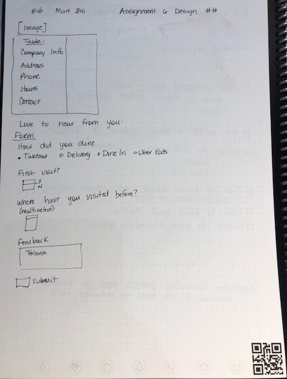

# Assignment 06
## Christine Martin
### Forms

**Describe any forms you've come across while browsing the web**
Being made aware of forms makes you more aware of them.  Forms are everywhere!
I use forms every day through work as people register for webinars and register to receive white papers.
I have completed forms for making hotel and plane reservations.
Today I used a form to order something online.
The one most used form is Google.

**What purposes do the serve?**
Forms facilitate the gathering of data from users through text boxes, check boxes, radio buttons, etc. The data is then sent for further processing.

**List examples of a text, selection, and button input, and where they might be used.**

**Free Response: Summarize your work cycle for this assignment.**
Made the decision to use notation in the index file to capture what each section is for reference purposes.
1. Made a list of required elements

2. Designed the table and form on another Rocketbook page

3. Create the head of the page
4. Save logo from actual website to images directory
5. Add table elements
6. Modify table elements to accommodate spacing
7. Add form elements
8. Experimented with the action being an email sent, however this seemed like an odd user experience.
9. Researched PHP actions fur the form
