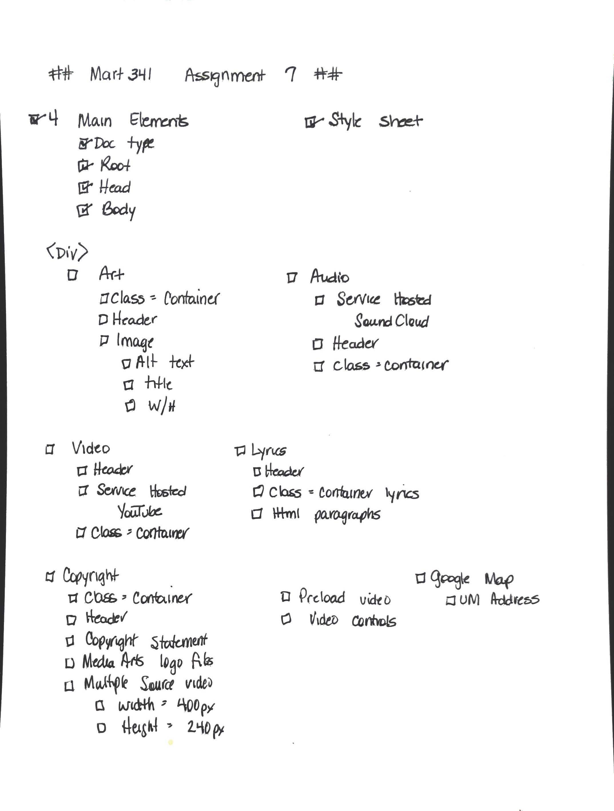
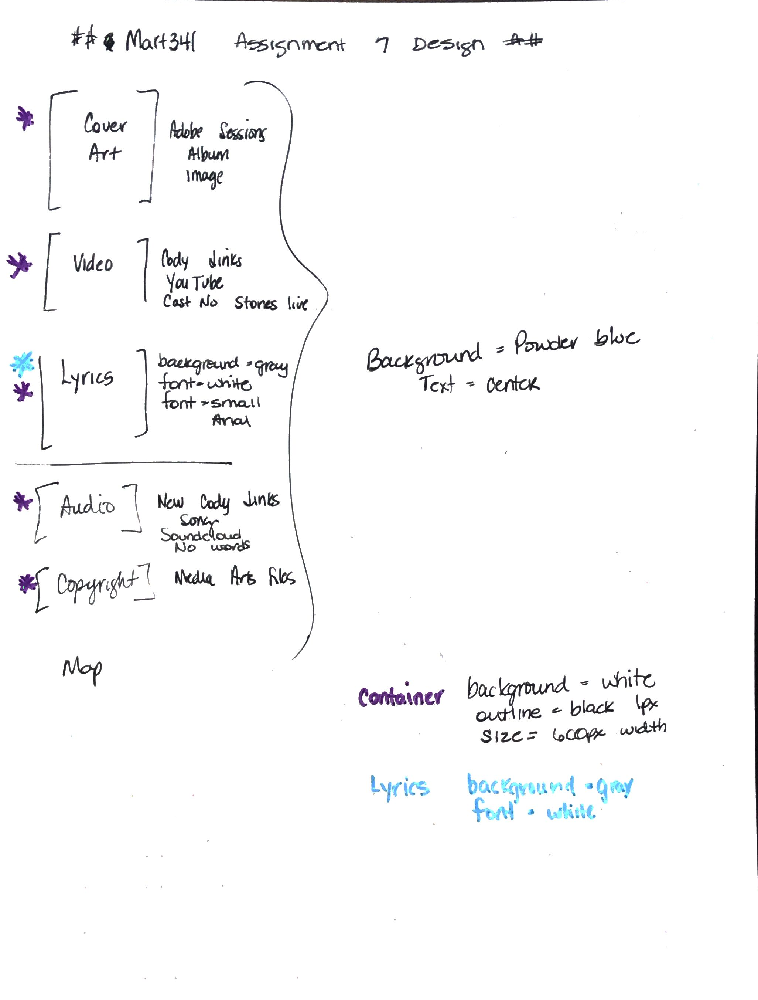

# Assignment 07
## Christine Martin
### Media

**Briefly describe the difference between divs, classes, ids, and spans**
The <div> element is simply a container to group its contents so a style can be easily added by using classes or id attributes.  

The class attribute specifies a name for an element, any HTML element, however it is mostly used to apply a style.  Class attribute specifies an action to be taken on one or more elements.  In this week's assignment each <div> element is assigned the class "Container".  Within the Head we define what style everything in the class "Container" should use.  We use 2 classes for the Lyrics section, which then applies 2 styles.

The ID attribute is similar to the class attribute, however it is used to indentify a single element.  The ID attribute is only used when a single element should have a specific style applied to it, as opposed to Class which can be applied to multiple elements.

The <span> tag is used for grouping, and applying, styles to inline elements.  Similar to the <div> tag, however <div> is used with a block of content rather than a single line. For example, if I want to apply a specific style to a sentence I can use the <span> tag, however if I want the style to be used to an entire section, I would use the <div> tag.

**What is "alt text," and why do we use it?**
"alt text" provides additional information for an image if a user is unable to view the image.  It is a required element for the  element

**Free Response: Summarize your work cycle for this assignment**
1. Documented all required elements of the assignment

2. Using my Rocketbook, designed a rough outline of what the page will look like.
 
3. Created applicable folders and files using Atom
Found album art and saved to image folder
4. Found song on Youtube that would be used, and copied link to html page using <!> tag to hide it from view.
5. Found song on Soundcloud that would be used for Audio section and copied to html page using <1> tag to hide from view.
6. Copied media arts files to media folder
I began by adding the main elements to the index Documented
7. Added required elements to index file
8. Copied the sytle sheet from the example provided and pasted to index file
9. Added each <div> element, including the classes
10. Added album art images
11. Added lyrics, using 2 classes and the <pre> tag.  The <pre> element allows text to be viewed exactly as it is written in the index file.
12. Added the video element by copying the previously saved Youtube informaiton
13. Researched verbiage for Copyright statements and added text
14. Added self hosted video elements to Copyright section
15. Added google maps to Copyright selection
16. Added Soundcloud audio to the Audio section

```

```
