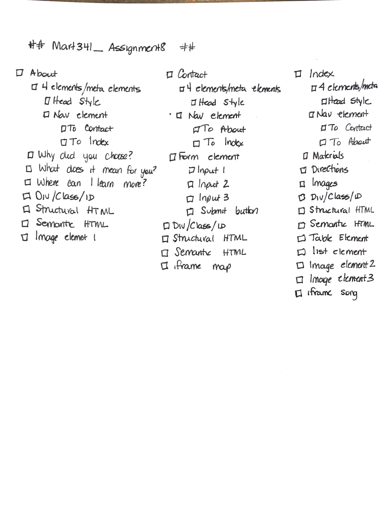

# Assignment 08
## Christine Martin
### HTML Website

**Briefly recap your experience learning HTML. What was old, new, interesting, or difficult to learn?**
I previously took a class on javascript, which made many of these concepts familiar.  I've enjoyed learning how to change the visuals,
and how elements can be layered to create a unique look.  I've found if I plan each assignment well, and design it befor starting, it makes
the project easier to complete.

**Next module we begin CSS and expand on styling, which helps us "decorate" HTML. Is there anything you're anxious or excited to learn about in this new section?**
I'm not anxious about CSS at all.  I've tried to incorporate some into this project with the help of online resources and our text book.
Excited to see what else we get done in the next few weeks!

**Summarize your work cycle for this assignment.**
1. Outlined required elements of assignment in Rocketbook

2. Designed what I wanted each page to look like
3. Researched and downloaded background image for About and Contact Me
4. Smoked cheesepuffs and took video of smoker starting up.  Saved video.
5. Add appropriate files and folders using Atom
6. Created each page.
7. Added the 4 required main document elements and meta elements to index.HTML
8. Copied the main document elements, and meta elements, from index.html and pasted them in about.html and contact.html, changing the title of each accordingly
9. Began working on Contact me page as the form was concerning
10. Crated the form, then added the background image.
11. Began with the basic elements for the About Me page
12. Added background photo and played with padding
13. Cropped picture of my cheesepuffs and played with adding it as a banner
14. Ate all the cheesepuffs and drank wine!
