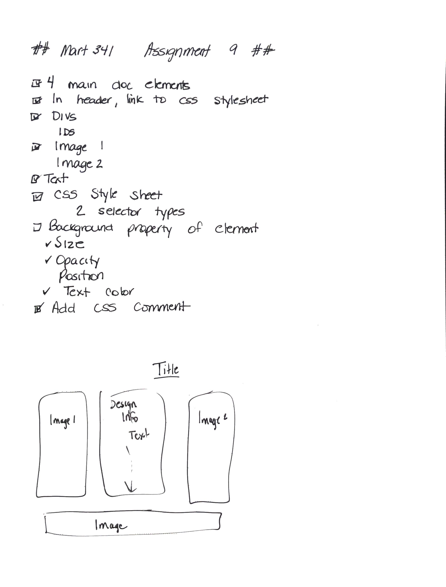

# Assignment 09
## Christine Martin
### Color

**Describe the difference between the universal, element,
 class, and id selector types. When might you choose one over the other to style content?**
 The universal element styles every element on a page.  To add a universal selector to a style sheet it must begin with a (*).

 An element selector applies style to a specific element.  To style an element, enter the element name.  For example, in my style sheet, you'll see I've styled "header 1", and have entered it as h1 {}.

Class selector applies a style only to the specified class.  Classes are identified in the sytle sheet with a beginning (.).

ID selector applies a style only to the specified id.  IDs are identified in the style sheet with a beginning (#)

Think of style as a heirarchy.  Apply a style to the entire page, and as you go further down, you may want a specific div to be styled differently, and a specific sentence or element to styled differently yet again.  Using the style sheet and the various style element selectors makes it easier to style pages without having retype the same things over and over.

**Briefly discuss your color palette, including the 3 colors you chose. List their color names, rgb values, or hex codes.**
I used primary colors on my page as that was the trend during the 80s.  
- Red
- Yellow
- Purple
- Blue,hex #0000ff;

**Free Response:  Summarize your work cycle for this assignment**
1. Wrote down all required elements of the assignment and created a sketch of what I think it would look like when complete

2.  Completed research and downloaded images
3. Researched flex containers as I wanted everything inline with color and contrast
