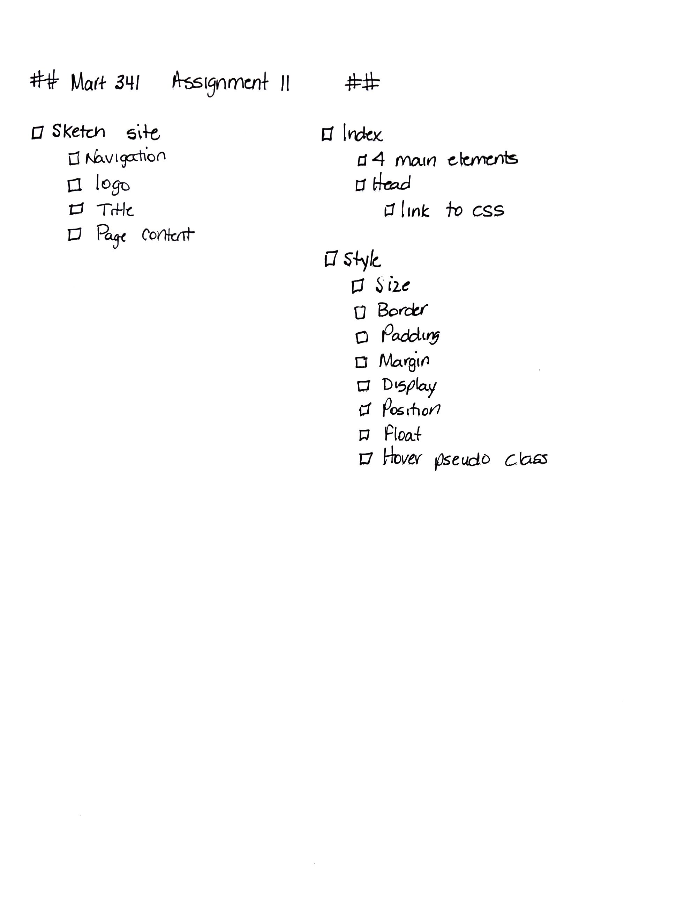

# Assignment 11
## Christine Martin
### Positioning

**What is the difference between padding, margin, and borders?**
Padding creates space around an element's content, inside defined borders
Margins create space around elements, outside of borders
Borders allow you to specify a style, width and color of an element's borders

**Embed the image of your sketch**

**Free Response: Summarize your work cycle for this assignment.**
1. Created all required folders and files in Atom
2. Wrote down all required elements in my 
3. Drew a picture of what I wanted the page to look like
4. Looked for pictures that fit the theme of the page
5. Began coding
6. Tested
