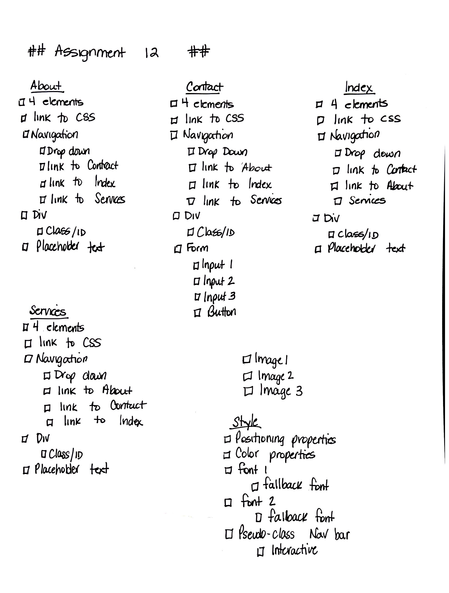

# Assignment 12
## Christine Martin
### CSS Website

**Who was your imaginary client? How did they describe their site needs?**
I actually used a real company, owned by a friend who doesn't have a website.
His requirements:
Must list all services they provide
Must have a way for Property management customers to reach them with an order for items prior to their arrival
Must have a page that explains their expertise and recommendations by prior customers
Must include picture of prior projects, and image of their logo

**What is the difference between display: block, display: inline, and display: inline-block?**
*Block* starts a new line, always takes up the full width and has top and bottom margins
*Display: inline* have no height and width properties
*Display: inline-block* allows you to set a width and height of an element

**Free Response: Summarize your work cycle for this assignment**
1. Create appropriate files and folders in Atom
2. Write down all requirements for the assignment in my 
3. Add 4 main elements and link to CSS in each page
4. Add links to social media sites, including tiktok
5. Downloaded social media icons to image folder
5. Add Navigation bar to index
6. Changed, and rechanged, the colors in the navbar
7.  Messed something up, scrapped all the work I had done and started overflow
