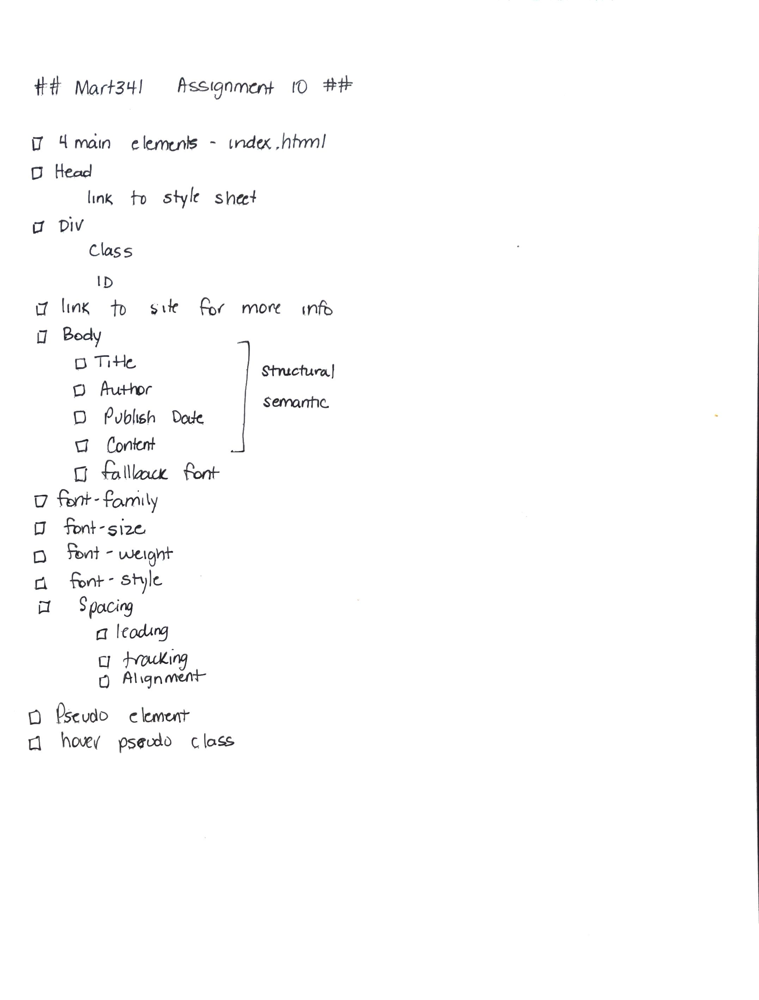

# Assignment 10
## Christine Martin
### Typography

**What is the difference between a system font, web font, and web-safe font?**
Operating systems have defaults fonts, system fonts.  System fonts keep the size of a website down because new fonts are not being loaded.  System fonts also provide a sense of familiarity to the reader as they are used to seeing these fonts on their computers daily.

Web fonts are those that are not native to the computer system and are downloaded, along with the website as it is accessed. Browsers must support web fonts in order to use them.

Web-safe fonts are universally installed across all browsers and devices.

**What is the importance of having fallback fonts or a font stack?**
If a browser does not support a font, having a fallback font will allow the site to be visible in another font.  A font stack is a list of fonts to be used in the CSS font-family declaration, listed in order of preference. For example html { font-family: Baker Street Ornaments, "Lucida Grande", Tahoma, Sans-Serif; } Tells the website to load using font "Backer Street Ornaments" first, but if that is not available use "Lucida Grande", if that is not available use Tahoma, etc.

**Free Response: Summarize your work cycle for this assignment.**
1.  As with other assignments, I created the appropriate folders and files in Atom
2.  I went about outlining all the required elements in

3. I then spent time trying to figure out what writings to use.  Maybe a poem.  Maybe a short story.  Or maybe one book that had a big impact on me, The Last Lecture.  [The Last Lecture, Randy Pausch](https://www.amazon.com/Last-Lecture-Randy-Pausch/dp/1401323251). I took an excerpt out of one of the chapters.
4. Loaded the 3 main elements of the file
5. Created the link to the style sheet
6. Found an image of the book cover and saved to image folders
7. Found the text I wanted and pasted it in the index file
8. Researched and experimented with various fonts, font styles, spacing, etc until I got the results I was looking for.
9. Made sure all elements of the assignment were included
10. Realized I didn't have a pseudo element other than the hover requirements, so researched cool things that can be done.  With this being excerpts having some medical text, thought it would be helpful to add something so the reader can get some tips on a word.
